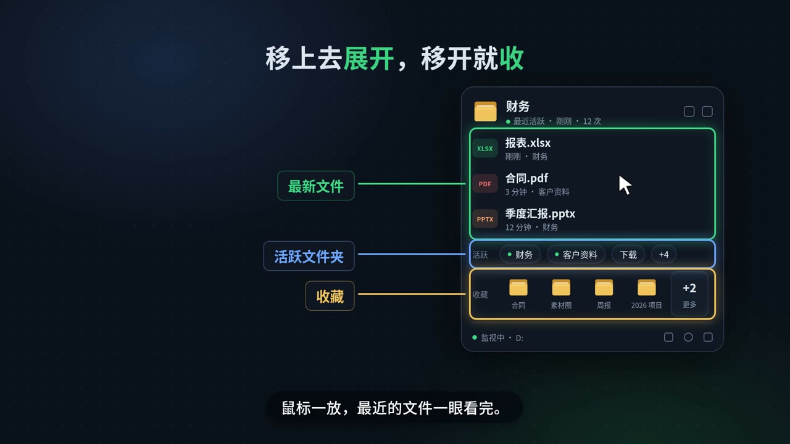

<p align="center">
  
</p>

<h1 align="center">DropSpot</h1>

<p align="center">
  刚改过的文件，马上找到；常用的文件和文件夹，一点就到。<br>
  一个趴在桌面角落的 Windows 小工具。
</p>

<p align="center">
  <a href="https://github.com/cslmqacq-lu/DropSpot/releases/latest">下载最新版</a> ·
  <a href="deliverables/intro-video-v1.0.8/DropSpot-intro-v1.0.8-配音版.mp4">看 60 秒介绍视频</a>
</p>

---

## 它解决什么问题

点了“导出”“另存为”或者“下载”，转头就找不到文件存到哪了：桌面没有，下载没有，文档也没有。

DropSpot 在后台留意硬盘上哪里刚写进了新文件，把最近活跃的文件夹和文件放在桌面右下角的悬浮舱里。保存完，看一眼右下角就行。

## 功能

| | |
| --- | --- |
| **新文件提醒** | 一保存，悬浮舱就提示刚写入的文件和所在文件夹 |
| **双击直达** | 打开文件夹，并在资源管理器里自动选中刚写入的文件 |
| **悬停展开** | 鼠标移上去展开面板：最新 3 个文件、活跃文件夹、收藏夹；移开自动收起 |
| **拖出来直接用** | 从面板把文件拖进微信、邮件或网页上传框 |
| **拖进来就收藏** | 文件夹拖到悬浮舱上加入收藏；单个文件拖进来打上 ★ 标记，归到所在的收藏夹下 |
| **全局快捷键** | `Ctrl+Alt+F` 打开最新文件夹，`Ctrl+Alt+D` 复制它的路径（可自定义） |
| **过滤垃圾文件** | 默认隐藏浏览器缓存、日志、临时文件、编译产物和 `.git`、`node_modules` 等目录；可加自定义扩展名和排除规则 |
| **贴边隐藏** | 拖到屏幕左右边缘缩成一根细条，鼠标移上去再展开 |
| **半透明背景** | 背景不透明度 50%–100% 可调，文字和图标保持清晰 |
| **省心** | 不扫描硬盘，开机自启；只需授权一次后台监视 |

<p align="center">
  
  
</p>

<sub>图片取自介绍动画，界面按软件实际布局绘制。</sub>

## 安装

在 [Releases](https://github.com/cslmqacq-lu/DropSpot/releases/latest) 页面下载：

- `DropSpot_Setup_v1.0.8_win-x64.exe`：安装版，装到当前用户目录，不需要管理员权限
- `DropSpot_v1.0.8_win-x64_portable.zip`：便携版，解压后双击 `DropSpot.exe`

两个版本都自带运行环境，不用另外安装 .NET。`SHA256SUMS.txt` 里有文件校验值。

**首次使用**：点悬浮舱里的“授权后台监视”，确认一次管理员授权。之后开机、启动都不会再弹窗。

> 程序没有数字签名，第一次运行时 Windows 可能提示“已保护你的电脑”，点“更多信息 → 仍要运行”即可。

## 使用小贴士

- 托盘图标左键：展开面板；右键：暂停监视、查看活动记录和诊断信息。
- 面板里的文件和文件夹都可以右键：打开、复制路径、收藏、加入排除。
- 底栏 ⚙ 打开设置：监视哪些磁盘、过滤规则、快捷键、背景透明度、随 Windows 启动。
- 设置和收藏保存在 `%AppData%\DropSpot`，换版本不会丢。

## 系统要求

- Windows 10 / 11，64 位
- 要监视的磁盘需要是 NTFS 或 ReFS（FAT32、exFAT、网络盘不支持）

## 工作原理

DropSpot 读取 Windows 自带的 NTFS / ReFS 文件变更日志（USN Journal），而不是递归监听或扫描目录，所以几乎不占资源：

- 每个磁盘只有一个增量读取循环，只关心新建、写入和重命名，删除事件直接忽略。
- 不读取文件内容，不计算哈希。
- 读取变更日志需要管理员权限，所以由一个经过一次授权的后台进程负责监视；界面本身以普通权限运行，拖放不受影响，两者通过仅限当前用户的命名管道通信。
- 只保存最近 50 个活跃文件夹的轻量记录，每 30 秒批量写一次设置。

## 从源码构建

需要 [.NET 8 SDK](https://dotnet.microsoft.com/download/dotnet/8.0)。

```powershell
dotnet build -c Release
dotnet run -- --smoke-test      # 内置自检
```

- `packaging\verify-build.cmd`：编译、自检并启动程序（开发调试用）
- `packaging\build-release.cmd`：生成单文件便携版和安装包（需要 [Inno Setup 6](https://jrsoftware.org/isinfo.php)），输出在 `dist` 目录

## 更新记录

**1.0.8**

- 主窗口改为悬浮舱：悬停展开，最新文件、活跃文件夹、收藏集中在一个面板里
- 设置界面重做；支持半透明背景和贴边隐藏
- 新增开发 / AI 编程文件过滤和自定义隐藏扩展名
- 拖文件或文件夹到悬浮舱即可收藏
- 界面以普通权限运行，后台监视单独授权，修复拖放失效

## 作者

cslm
